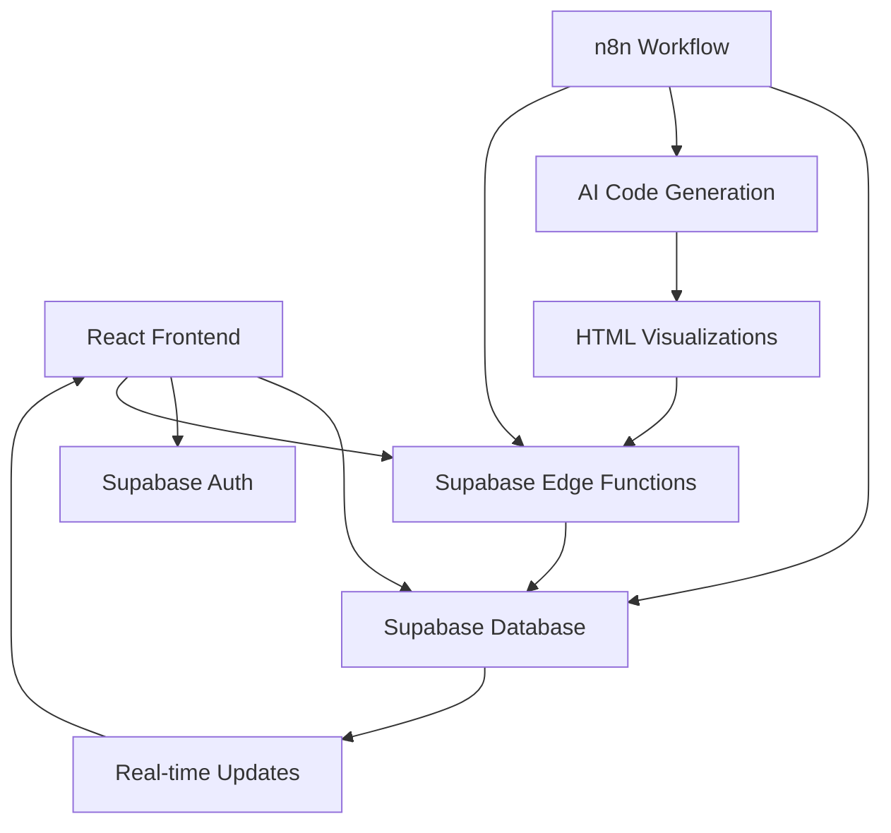

# 🎯 Algorhythm - Interactive Algorithm Visualizer

[](https://algorhythm.netlify.app)
[](https://opensource.org/licenses/MIT)
[](https://reactjs.org/)
[](https://www.typescriptlang.org/)
[](https://supabase.com/)

> Transform complex algorithms into beautiful, interactive visualizations. Submit your algorithm questions and get custom HTML visualizations with step-by-step explanations in your preferred programming language.


## ✨ Features

### 🎨 **Interactive Visualizations**
- **Custom Algorithm Animations**: Submit any algorithm question and get a tailored visualization
- **Multi-Language Support**: Get solutions in your preferred programming language (JavaScript, Python, Java, C++, etc.)
- **Step-by-Step Explanations**: Clear, beginner-friendly explanations for each step
- **Playback Controls**: Play, pause, step forward/backward through algorithm execution
- **Real-time Updates**: Live status tracking for question processing

### 🔧 **Technical Features**
- **Modern React + TypeScript**: Type-safe, component-based architecture
- **Supabase Integration**: Real-time database, authentication, and edge functions
- **n8n Automation**: Automated HTML generation and processing pipeline
- **Responsive Design**: Works perfectly on desktop, tablet, and mobile
- **Dark Theme**: Clean, modern interface with smooth animations

### 🚀 **User Experience**
- **Authentication Required**: Secure user accounts for personalized experience
- **User Dashboard**: Save questions, track progress, view history
- **Language Preferences**: Set your preferred programming language for solutions
- **Download Solutions**: Get HTML files for offline use
- **Real-time Status**: Live updates on question processing

## 🌐 **Supported Programming Languages**

Algorhythm supports algorithm visualizations in multiple programming languages:

### **Primary Languages**
- **JavaScript** - Interactive web-based visualizations
- **Python** - Clean, readable algorithm implementations
- **Java** - Object-oriented algorithm solutions
- **C++** - Performance-optimized implementations

### **Additional Languages**
- **C** - Low-level algorithm implementations
- **Go** - Modern, efficient solutions
- **Rust** - Memory-safe algorithm implementations
- **TypeScript** - Type-safe JavaScript solutions

### **Language Selection**
- Set your preferred language in user settings
- Get algorithm explanations tailored to your chosen language
- Code examples and visualizations adapt to language syntax
- Switch languages anytime from your dashboard

## 🏗️ Architecture



### **Frontend Stack**
- **React 18** with TypeScript for type safety
- **Tailwind CSS** for responsive styling
- **React Router** for navigation
- **Zustand** for state management
- **React Hot Toast** for notifications

### **Backend Stack**
- **Supabase** for database, auth, and real-time features
- **PostgreSQL** with Row Level Security (RLS)
- **Edge Functions** for serverless processing
- **n8n** for workflow automation

### **Automation Pipeline**
- **Polling-based Processing**: n8n polls database for new questions
- **AI Code Generation**: Automated HTML visualization creation with language-specific code
- **File Upload**: Secure solution storage and delivery
- **Status Updates**: Real-time progress tracking

## 🚀 Quick Start

### Prerequisites
- Node.js 18+ 
- npm or yarn
- Supabase account
- n8n instance (optional)

### 1. Clone & Install
```bash
git clone https://github.com/yourusername/algorhythm.git
cd algorhythm
npm install
```

### 2. Environment Setup
```bash
cp .env.example .env
```

Edit `.env` with your credentials:
```env
VITE_SUPABASE_URL=https://your-project.supabase.co
VITE_SUPABASE_ANON_KEY=your-anon-key
VITE_N8N_WEBHOOK_URL=https://your-n8n-instance.com/webhook
VITE_N8N_API_KEY=your-api-key
```

### 3. Database Setup
Run the Supabase migrations:
```bash
# In your Supabase dashboard, run the SQL migrations from supabase/migrations/
```

### 4. Start Development
```bash
npm run dev
```

Visit `http://localhost:5173` to see the app running!

## 📊 Database Schema

### **user_questions Table**
```sql
CREATE TABLE user_questions (
  id UUID PRIMARY KEY DEFAULT gen_random_uuid(),
  question TEXT NOT NULL,
  user_email TEXT,
  user_name TEXT,
  user_id UUID REFERENCES auth.users(id),
  preferred_language TEXT DEFAULT 'javascript',
  status TEXT DEFAULT 'pending' CHECK (status IN ('pending', 'processing', 'completed', 'failed')),
  generated_solution TEXT,
  created_at TIMESTAMPTZ DEFAULT now(),
  updated_at TIMESTAMPTZ DEFAULT now()
);
```

### **user_preferences Table**
```sql
CREATE TABLE user_preferences (
  id UUID PRIMARY KEY DEFAULT gen_random_uuid(),
  user_id UUID REFERENCES auth.users(id) UNIQUE,
  preferred_language TEXT DEFAULT 'javascript' CHECK (preferred_language IN (
    'javascript', 'python', 'java', 'cpp', 'c', 'go', 'rust', 'typescript'
  )),
  theme TEXT DEFAULT 'dark' CHECK (theme IN ('light', 'dark')),
  notification_preferences JSONB DEFAULT '{"email": true, "browser": true}',
  created_at TIMESTAMPTZ DEFAULT now(),
  updated_at TIMESTAMPTZ DEFAULT now()
);
```

### **Security Policies**
- **Public Insert**: Anyone can submit questions
- **User Read**: Users can read their own questions and preferences
- **Admin Access**: Full read/write for processing
- **Service Role**: Complete access for automation

## 🔧 n8n Integration

### **Polling Workflow**
The n8n workflow automatically:
1. **Polls** database every 2 minutes for pending questions
2. **Processes** questions using AI code generation with user's preferred language
3. **Uploads** HTML solutions via edge functions
4. **Updates** question status in real-time

### **Language-Aware Processing**
- Reads user's preferred language from database
- Generates code examples in the specified language
- Adapts explanations to language-specific syntax
- Provides language-appropriate best practices

### **Manual Setup**
1. Import the n8n workflow (contact for workflow file)
2. Configure Supabase credentials
3. Set up AI service (Gemini/OpenAI) with language support
4. Test the polling endpoint

### **API Endpoints**
```typescript
// Get pending questions with language preferences
GET /rest/v1/rpc/get_pending_questions?limit_count=5

// Upload solution with language-specific content
POST /functions/v1/upload-solution
Headers: { "x-api-key": "your-key" }
Body: { questionId, htmlContent, language, metadata }

// Update user language preference
POST /rest/v1/user_preferences
Body: { user_id, preferred_language }
```

## 🎨 Features Deep Dive

### **Algorithm Visualizer**
- Submit questions like "Show me how bubble sort works in Python"
- Get interactive HTML with language-specific animations
- Step-by-step code explanations in your preferred language
- Customizable input data with language syntax highlighting

### **Language Preferences**
- Set default programming language in user settings
- Override language for specific questions
- Get explanations tailored to language paradigms
- Code examples follow language conventions

### **User Dashboard**
- View all submitted questions with language tags
- Track processing status with real-time updates
- Download completed solutions in preferred language
- Manage language preferences and settings

### **Authentication System**
- Secure email/password authentication
- User registration and login
- Protected routes and features
- Session management

## 🚀 Deployment

### **Frontend (Netlify)**
```bash
npm run build
# Deploy dist/ folder to Netlify
```

### **Backend (Supabase)**
1. Create Supabase project
2. Run database migrations (including user_preferences table)
3. Deploy edge functions
4. Configure environment variables

### **Environment Variables**
```env
# Production
VITE_SUPABASE_URL=https://your-prod-project.supabase.co
VITE_SUPABASE_ANON_KEY=your-prod-anon-key

# Optional n8n
VITE_N8N_WEBHOOK_URL=https://your-n8n.com/webhook
VITE_N8N_API_KEY=your-secure-key
```

## 🔒 Security

### **Authentication**
- Secure email/password authentication
- Session management with Supabase Auth
- Protected routes and API endpoints

### **Database Security**
- Row Level Security (RLS) policies
- User-specific data access
- Secure API key validation

### **File Upload Security**
- HTML-only file validation
- Size limits (5MB max)
- Content sanitization
- API key authentication

## 🧪 Development

### **Project Structure**
```
src/
├── components/          # Reusable UI components
├── pages/              # Route components
├── hooks/              # Custom React hooks
├── lib/                # Utilities and services
├── utils/              # Helper functions
└── types/              # TypeScript definitions

supabase/
├── functions/          # Edge functions
└── migrations/         # Database migrations
```

### **Available Scripts**
```bash
npm run dev          # Start development server
npm run build        # Build for production
npm run preview      # Preview production build
npm run lint         # Run ESLint
```

### **Code Quality**
- TypeScript for type safety
- ESLint for code quality
- Prettier for formatting
- Component-based architecture

## 📈 Performance

### **Optimization**
- Code splitting with React Router
- Lazy loading of components
- Optimized database queries
- Efficient real-time subscriptions

### **Monitoring**
- Real-time question processing stats
- User engagement metrics
- Language preference analytics
- System performance tracking

## 🤝 Contributing

We welcome contributions! Please see our [Contributing Guide](CONTRIBUTING.md) for details.

### **Development Setup**
1. Fork the repository
2. Create a feature branch
3. Make your changes
4. Add tests if applicable
5. Submit a pull request

### **Code Style**
- Use TypeScript for all new code
- Follow existing component patterns
- Add proper error handling
- Include JSDoc comments for functions

## 📄 License

This project is licensed under the MIT License - see the [LICENSE](LICENSE) file for details.

## 🆘 Support

- **Documentation**: Check this README and inline comments
- **Issues**: Create a GitHub issue for bugs or feature requests
- **Discussions**: Use GitHub Discussions for questions
- **Email**: Contact the development team

## 🙏 Acknowledgments

- **Supabase** for the amazing backend platform
- **n8n** for workflow automation capabilities
- **React Team** for the excellent frontend framework
- **Tailwind CSS** for the utility-first CSS framework
- **Community** for feedback and contributions

---

**Built with ❤️ using React, TypeScript, Supabase, and n8n**

**Supporting 8+ Programming Languages for Algorithm Visualizations**